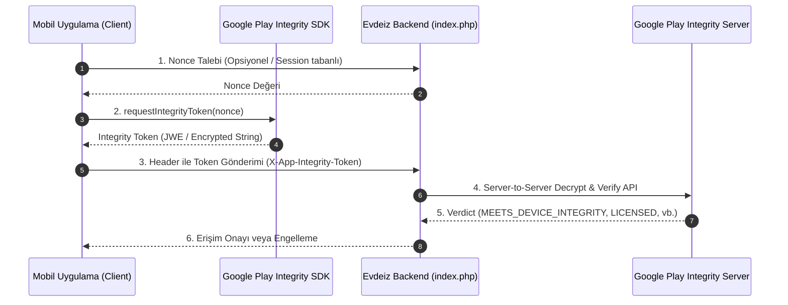

# Emülatör / Sahte Cihaz Tespiti — Güncellenmiş ve Revize Edilmiş İlerleme Planı

**Proje:** Evdeiz (Expo / React Native WebView Container App)  
**Tarih:** 11 Ağustos 2026  
**Durum:** Faz 1 Tamamlandı (Aktif Kullanımda) | Faz 2 Planlama Aşamasında  
**Hedef:** Basit keyword-tabanlı emülatör tespitini, çoklu sinyal + skorlama sistemine ve sunucu taraflı Google Play Integrity API doğrulamasına yükseltmek.

---

## 1. Kapsam ve Güncel Durum Özeti

| Hedef ID | Açıklama | Güncel Durum |
|---|---|---|
| **G1** | Tek keyword yerine çoklu bağımsız sinyalden dinamik skor üretilmesi | ✅ **Tamamlandı** (`utils/emulatorDetection.ts`) |
| **G2** | JS-only (native modül gerektirmeyen) sinyallerin devreye alınması | ✅ **Tamamlandı** (Expo Device & Network entegrasyonu) |
| **G3** | Google Play Integrity API ile manipüle edilemez sunucu doğrulaması | ⏳ **Faz 2** (EAS Build / Prebuild aşamasında) |
| **G4** | Skor ve detaylı tespit gerekçelerinin backend'e header olarak iletilmesi | ✅ **Tamamlandı** (`X-App-Suspicion-Score`, `X-App-Detection-Reasons`) |
| **G5** | Yanlış pozitifleri (false-positive) önlemek için loglama ve kalibrasyon altyapısı | ✅ **Tamamlandı** (`index.php` loglama ve HTML bilgi kartı) |

---

## 2. Faz 1 — Çoklu Sinyal Skorlama Sistemi (Tamamlanan Uygulama)

### 2.1 Modül: `utils/emulatorDetection.ts`

Mevcut `App.tsx` içerisindeki zayıf inline tespit mantığı tamamen kaldırılarak modüler ve genişletilebilir bir yapı oluşturuldu. 

#### Sinyaller ve Ağırlık Matrisi

| # | Sinyal Adı | Kaynak | Ağırlık | Açıklama / Gerekçe |
|---|---|---|---|---|
| **1** | `Device.isDevice === false` | `expo-device` | **100** | Expo native tespiti. Kesin sanal ortam göstergesidir. |
| **2** | Genişletilmiş Fingerprint Eşleşmesi | `deviceName`, `modelName`, `brand`, `manufacturer`, `productName`, `designName` | **60** | Tanımlı emülatör / sanal motor keyword taraması. |
| **3** | Emülatör NAT IP Aralığı | `expo-network` (`10.0.2.x` / `10.0.3.x`) | **30** | Android Studio AVD ve Genymotion varsayılan NAT aralığı. |
| **4** | Tam x86/x86_64 CPU Mimarisi | `expo-device` (`supportedCpuArchitectures`) | **25** | Gerçek Android cihazlar ezici çoğunlukla ARM mimarilidir. |
| **5** | Generic / SDK Cihaz Tanımları | `modelName`, `brand`, `productName` | **20** | `generic`, `sdk`, `google_sdk`, `vbox` gibi standart imaj ibareleri. |
| **6** | Tam GB Yuvarlak Bellek Değeri | `expo-device` (`totalMemory`) | **10** | Emülatörler genelde tam 2048, 4096, 8192 MB gibi RAM alır. |

> [!NOTE]
> **Eşik Değeri:** Toplam skor `suspicionScore >= 50` olduğunda `isPhysical = false` kabul edilir (Maksimum skor 100 ile sınırlandırılmıştır).

### 2.2 Genişletilmiş Keyword Listesi

Taranan keyword kümesi modern emülatör ve sanal ortamları kapsayacak şekilde genişletilmiştir:
`bluestacks`, `bstk`, `nox`, `memu`, `genymotion`, `koplayer`, `gameloop`, `mumu`, `sdk_google`, `generic_x86`, `emulator`, `sdk_gphone`, `android sdk`, `goldfish`, `ranchu`, `vbox`, `virtual`, `droid4x`, `ldplayer`, `andy`, `windroye`, `phoenix`, `microvirt`, `vmos`, `shengqi`, `titan`, `ttvm`, `xiaowei`, `leidian`.

### 2.3 Uygulanan Frontend Entegrasyonu (`App.tsx`)

`App.tsx` içerisindeki `loadDeviceInfo()` fonksiyonu güncellenerek WebView header'larına yeni güvenlik parametreleri eklenmiştir:

```typescript
const detection = detectEmulator(ip || '');

setDeviceInfo({
  ip: ip || '',
  deviceName: Device.deviceName || Platform.OS,
  modelName: Device.modelName || Platform.OS,
  osVersion: Device.osVersion || String(Platform.Version),
  brand: Device.brand || Platform.OS,
  isPhysicalDevice: detection.isPhysical,
  isVpnActive: isVpn,
  suspicionScore: detection.suspicionScore,
  reasons: detection.reasons,
});
```

#### İletilen HTTP Header'ları:
- `X-App-Is-Physical-Device`: `"true"` veya `"false"`
- `X-App-Suspicion-Score`: Sayısal skor (örn. `"0"`, `"35"`, `"100"`)
- `X-App-Detection-Reasons`: Tetiklenen sinyaller (örn. `"keyword_fingerprint_match,emulator_ip_range"`)

---

## 3. Backend Entegrasyonu (`index.php`)

Backend tarafı gelen yeni header'ları işleyerek hem güvenlik loglarına yazmakta hem de uygulama arayüzünde canlı göstermektedir.

### 3.1 Header Okuma ve Doğrulama
```php
$suspicionScore   = isset($_SERVER['HTTP_X_APP_SUSPICION_SCORE']) ? (int)$_SERVER['HTTP_X_APP_SUSPICION_SCORE'] : null;
$detectionReasons = trim($_SERVER['HTTP_X_APP_DETECTION_REASONS'] ?? '');
```

### 3.2 Loglama
```php
securityLog($logDir, sprintf(
    'OK | IP=%s | LOCAL=%s | PLATFORM=%s | VERSION=%s | VPN=%s | SUSPICION=%s | REASONS=%s',
    sanitizeForLog($remoteIp),
    sanitizeForLog($appLocalIp ?: 'YOK'),
    sanitizeForLog($appPlatform),
    sanitizeForLog($appVersion),
    $isVpnActive ? 'EVET' : 'HAYIR',
    $suspicionScore !== null ? (string)$suspicionScore : 'N/A',
    sanitizeForLog($detectionReasons ?: 'NONE')
));
```

### 3.3 Arayüzde Şüphe Skor Gösterimi
PHP katmanı `suspicionScore` değerine göre dinamik renk kodlaması yapar:
- **0 - 19:** 🟢 Düşük / Temiz (`#15803d`)
- **20 - 49:** 🟠 Orta Şüphe (`#d97706`)
- **50 - 100:** 🔴 Yüksek Şüphe / Emülatör Engeli (`#b91c1c`)

---

## 4. Faz 2 — Google Play Integrity API (Gelecek Aşama)

> [!IMPORTANT]
> Faz 1 client-side JS sinyallerine dayanır. İleri seviye tersine mühendislik / JS enjeksiyonu durumlarına karşı %100 manipüle edilemez koruma **Google Play Integrity API** ile sağlanır.

### 4.1 Mimari Akış



### 4.2 Teknik Gereksinimler ve Ön Hazırlıklar
1. **EAS Build / Development Client Geçişi:** `expo-play-integrity` veya native config plugin kullanımı gerektiğinden pure Expo Go yerine custom native build alınmalıdır.
2. **Google Play Console & Cloud Project Kurulumu:** 
   - Google Play Console üzerinde Play Integrity API aktif edilmeli.
   - Google Cloud ortamında Service Account oluşturulup JSON anahtarı backend sunucusuna eklenmeli.
3. **Arka Plan Doğrulama:** UX gecikmesini önlemek adına WebView yüklemesi engellenmeden token alma işlemi arka planda asenkron yürütülmelidir.

---

## 5. Değişiklik ve Dosya Haritası

| Dosya / Modül | Tür | Açıklama | Durum |
|---|---|---|---|
| [`utils/emulatorDetection.ts`](file:///c:/Users/AlperenAKKAYA/Desktop/app.ios/utils/emulatorDetection.ts) | Frontend | Çoklu sinyal skorlama mantığı ve tip tanımları | ✅ **Tamamlandı** |
| [`App.tsx`](file:///c:/Users/AlperenAKKAYA/Desktop/app.ios/App.tsx) | Frontend | Cihaz tespiti çağrısı ve WebView header entegrasyonu | ✅ **Tamamlandı** |
| [`index.php`](file:///c:/Users/AlperenAKKAYA/Desktop/app.ios/index.php) | Backend | Header parsing, güvenlik logları ve UI skor gösterimi | ✅ **Tamamlandı** |
| `utils/playIntegrity.ts` | Frontend | Play Integrity token edinme servisi | ⏳ **Faz 2** |
| `app.json` | Konfig | Native build plugin ve Play Integrity paket ayarları | ⏳ **Faz 2** |

---

## 6. Kalibrasyon, Test ve Doğrulama Süreci

### 6.1 Tamamlanan Testler
- ✅ **Statik Tip Kontrolü:** `npx tsc --noEmit` ile hatasız derleme doğrulandı.
- ✅ **Sinyal Ağırlık Mantığı:** CPU mimarisi, IP bloğu ve cihaz model bilgileri tespiti doğrulandı.

### 6.2 Canlı İzleme ve Kalibrasyon Adımları
1. **Log Analizi:** `logs/security.log` dosyası üzerinden gerçek kullanıcıların şüphe skorları izlenecektir.
2. **Eşik Ayarlaması:** Yanlış pozitif üretme riski taşıyan özel Android ROM'lar (örn. bazı Xiaomi / Huawei modelleri) tespit edilirse ilgili keyword veya generic string ağırlığı düşürülecektir.
3. **Muhafazakar Yaklaşım:** Başlangıç aşamasında otomatik engelleme yerine loglama modu aktif tutulmaktadır.

---

## 7. Uygulama Sırası ve Gelecek Adımlar

- [x] **Adım 1:** `utils/emulatorDetection.ts` modülünün oluşturulması.
- [x] **Adım 2:** `App.tsx` entegrasyonu ve `X-App-Suspicion-Score` ile `X-App-Detection-Reasons` header'larının eklenmesi.
- [x] **Adım 3:** Backend (`index.php`) tarafında yeni header'ların loglanması ve arayüzde gösterilmesi.
- [x] **Adım 4:** TypeScript tip kontrolü ve derleme doğrulaması.
- [ ] **Adım 5:** 1-2 haftalık gerçek trafik verisiyle skor dağılımının izlenmesi.
- [ ] **Adım 6:** Faz 2 (Google Play Integrity API) için EAS Build ve Google Cloud Service Account kurulumlarının başlatılması.
